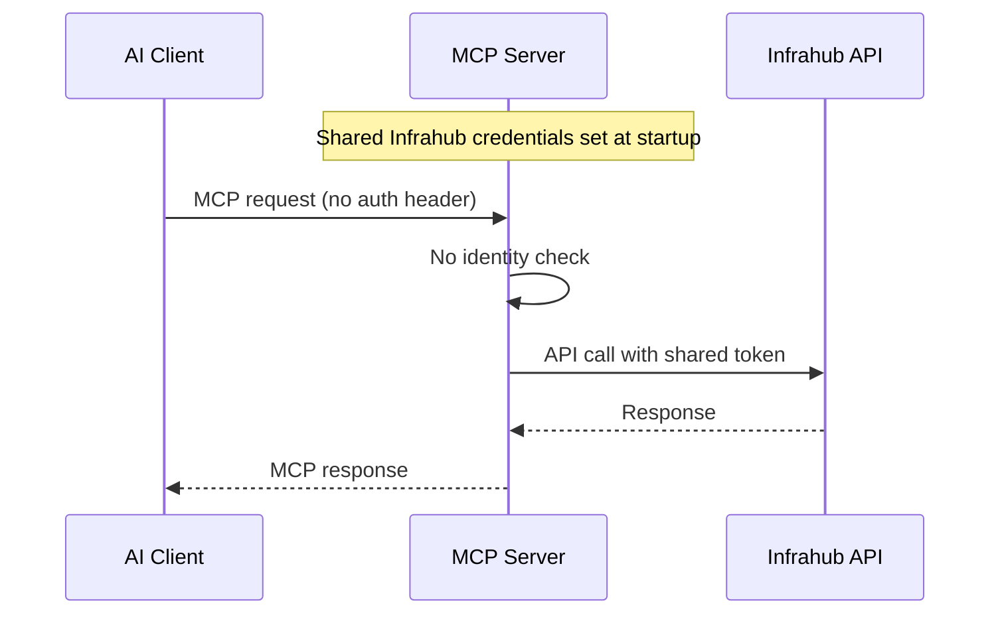
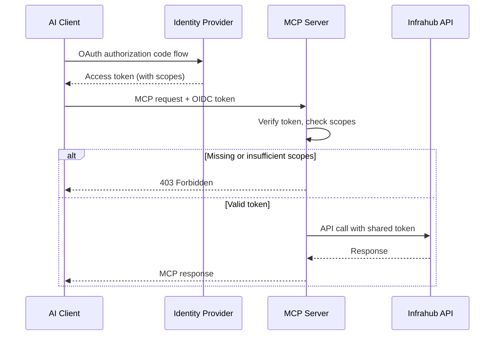
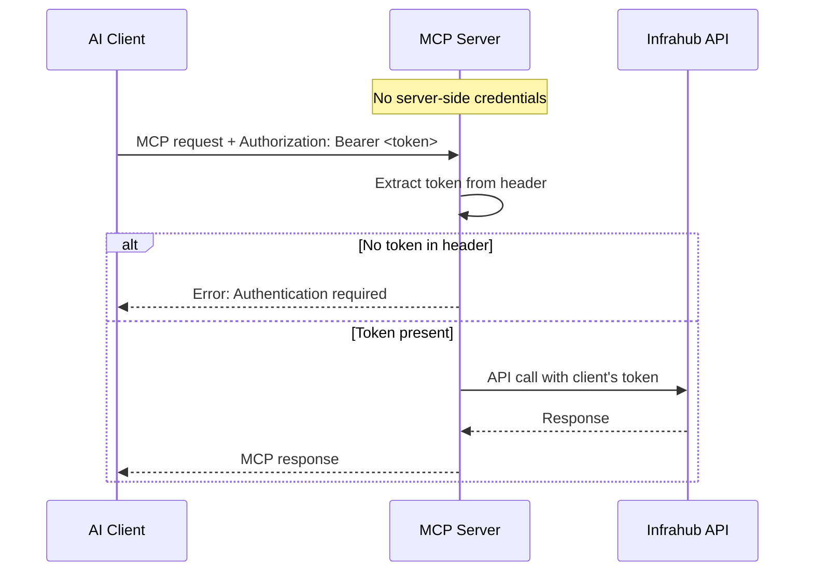

This guide explains the authentication and authorization model of the Infrahub MCP server: why it works the way it does, how the three auth modes differ, and how to configure each one for your deployment.

## Architecture overview

The MCP server sits between AI clients (Claude, Cursor, VS Code Copilot) and the Infrahub API. Authentication happens at two separate layers:

1. **MCP layer** — controls *who* can reach the MCP server and *what* they can do (read-only vs read-write). Configured via `INFRAHUB_MCP_AUTH_MODE`.
2. **Infrahub layer** — controls *what* the MCP server can do in Infrahub. Configured via `INFRAHUB_API_TOKEN` or `INFRAHUB_USERNAME`/`INFRAHUB_PASSWORD` (for `none` and `oidc` modes), or via the client's own token (for `token-passthrough` mode).

In `none` and `oidc` modes, the Infrahub credentials are shared across all MCP sessions — they define the ceiling of what any client can do, and the MCP auth layer narrows that ceiling per-user. In `token-passthrough` mode, each client provides their own Infrahub API token, so there are no shared credentials.

### `none` — shared credentials, no identity



### `oidc` — identity + scopes via external IdP



### `token-passthrough` — client's own Infrahub token



## Auth modes

### `none` (default)

No identity gate at the MCP level. Any client that can reach the server gets access using the shared Infrahub credentials. This is the right choice when:

- You are running the server locally via **stdio** transport (single-user, no network exposure).
- The server is behind a VPN or network-level access control and you trust all clients equally.
- You want the simplest possible setup.

No additional configuration is required beyond the standard Infrahub connection variables.

```bash
# Minimal setup — no MCP-level auth
export INFRAHUB_ADDRESS=https://infrahub.example.com
export INFRAHUB_API_TOKEN=your-token
uv run fastmcp run src/infrahub_mcp/server.py:mcp
```

### `oidc`

External Identity Provider authentication via OpenID Connect. When enabled, the MCP server delegates authentication to a provider like Google, Okta, or Microsoft Entra using FastMCP's `OIDCProxy`. This is the right choice when:

- Multiple users share a single MCP server instance over HTTP.
- You need **audit trails** that identify who performed each action.
- You want **role-based access control** — some users get read-only, others get read-write.
- Compliance requires identity verification before infrastructure changes.

OIDC mode requires the **Streamable HTTP transport** — it is not supported over stdio.

### `token-passthrough`

Each MCP client provides their own Infrahub API token in the HTTP request header. The server extracts it and creates a per-request `InfrahubClient` using that token — no shared server-side credentials needed. This is the right choice when:

- Each user already has their own Infrahub API token.
- You want **end-to-end credential isolation** — the server never stores or shares tokens between users.
- You need a simpler setup than OIDC but still want multi-user support.
- You want Infrahub's native RBAC to control what each user can do.

Token passthrough is **fail-closed**: every request must carry a valid token. If the header is missing or empty, the request is rejected — there is no silent fallback to server-side credentials.

```bash
# Token passthrough — each client sends their own Infrahub token
export INFRAHUB_ADDRESS=https://infrahub.example.com
export INFRAHUB_MCP_AUTH_MODE=token-passthrough

# No INFRAHUB_API_TOKEN needed — credentials come from the client
infrahub-mcp --transport streamable-http
```

Clients send their token in the `Authorization` header (default) with a `Bearer` prefix:

```text
Authorization: Bearer <infrahub-api-token>
```

The header name is configurable via `INFRAHUB_MCP_TOKEN_PASSTHROUGH_HEADER` if your setup requires a different header (for example, `X-Infrahub-Token`).

Token passthrough requires the **Streamable HTTP transport** — it is not supported over stdio (no HTTP headers available). The server rejects this combination at startup.

## Setting up OIDC authentication

### Prerequisites

- An OIDC-compatible Identity Provider (Google, Okta, Microsoft Entra, Keycloak, Authentik)
- An OAuth client registered with your IdP, configured for the authorization code flow
- The MCP server deployed with a public URL accessible to users' browsers (for the OAuth redirect)

<!-- vale Infrahub.sentence-case = NO -->

### Step 1: Register an OAuth client

In your Identity Provider, create an OAuth/OIDC client application:

- **Application type**: Web application
- **Redirect URI**: `<your-mcp-base-url>/oauth/callback` (FastMCP handles this automatically)
- **Scopes**: At minimum, `openid`, `email`, and `profile`. Add a custom scope (for example, `write` or `infrahub:write`) if you want to gate write access.

Record the **client ID**, **client secret** (if not using PKCE), and the **OIDC discovery URL**.

<!-- vale Infrahub.sentence-case = YES -->

### Step 2: Configure the MCP server

Set the required environment variables:

```bash
export INFRAHUB_MCP_AUTH_MODE=oidc
export INFRAHUB_MCP_OIDC_CONFIG_URL=https://accounts.google.com/.well-known/openid-configuration
export INFRAHUB_MCP_OIDC_CLIENT_ID=my-mcp-client
export INFRAHUB_MCP_OIDC_BASE_URL=https://mcp.example.com

# Optional — omit for PKCE flow (recommended for public clients)
export INFRAHUB_MCP_OIDC_CLIENT_SECRET=my-secret
```

The server validates that all required OIDC fields are set at startup and fails fast with a clear error if anything is missing.

### Step 3: Configure write scopes (optional)

By default, any authenticated user can call both read and write tools. To restrict write access to users with a specific scope in their token:

```bash
# Only users whose token contains "infrahub:write" can call write tools
export INFRAHUB_MCP_AUTH_SCOPES_WRITE=infrahub:write
```

When configured, tools tagged `write` (`node_upsert`, `node_delete`, `propose_changes`, `mutate_graphql`) are:

1. **Hidden from discovery** — users without the required scope never see write tools in `tools/list`.
2. **Blocked at call time** — even if a client hardcodes a tool name, the call is rejected.

Users without the write scope effectively get a read-only experience without needing `INFRAHUB_MCP_READ_ONLY=true`.

<!-- vale Infrahub.sentence-case = NO -->

### Step 4: Verify

<!-- vale Infrahub.sentence-case = YES -->

Start the server and confirm the OIDC configuration in the logs:

```text
INFO  oidc_auth enabled=true config_url=https://accounts.google.com/... client_id=my-mcp-client
INFO  auth_middleware enabled=true auth_mode=oidc write_scopes=['infrahub:write']
```

## Provider-specific examples

### Google

```bash
INFRAHUB_MCP_AUTH_MODE=oidc
INFRAHUB_MCP_OIDC_CONFIG_URL=https://accounts.google.com/.well-known/openid-configuration
INFRAHUB_MCP_OIDC_CLIENT_ID=123456789.apps.googleusercontent.com
INFRAHUB_MCP_OIDC_CLIENT_SECRET=GOCSPX-...
INFRAHUB_MCP_OIDC_BASE_URL=https://mcp.example.com
```

<!-- vale Infrahub.spelling = NO -->
<!-- vale Infrahub.sentence-case = NO -->

### Okta

```bash
INFRAHUB_MCP_AUTH_MODE=oidc
INFRAHUB_MCP_OIDC_CONFIG_URL=https://your-org.okta.com/.well-known/openid-configuration
INFRAHUB_MCP_OIDC_CLIENT_ID=0oa...
INFRAHUB_MCP_OIDC_BASE_URL=https://mcp.example.com
INFRAHUB_MCP_AUTH_SCOPES_WRITE=infrahub:write
```

### Microsoft Entra

```bash
INFRAHUB_MCP_AUTH_MODE=oidc
INFRAHUB_MCP_OIDC_CONFIG_URL=https://login.microsoftonline.com/{tenant-id}/v2.0/.well-known/openid-configuration
INFRAHUB_MCP_OIDC_CLIENT_ID=your-app-id
INFRAHUB_MCP_OIDC_BASE_URL=https://mcp.example.com
INFRAHUB_MCP_OIDC_AUDIENCE=api://your-app-id
```

### Keycloak

```bash
INFRAHUB_MCP_AUTH_MODE=oidc
INFRAHUB_MCP_OIDC_CONFIG_URL=https://keycloak.example.com/realms/infrahub/.well-known/openid-configuration
INFRAHUB_MCP_OIDC_CLIENT_ID=infrahub-mcp
INFRAHUB_MCP_OIDC_BASE_URL=https://mcp.example.com
INFRAHUB_MCP_AUTH_SCOPES_WRITE=write
```

<!-- vale Infrahub.spelling = YES -->
<!-- vale Infrahub.sentence-case = YES -->

## User identity and branch naming

When OIDC is enabled, the authenticated user identity flows into two features:

### Audit logs

Every tool call and resource read includes the user identity in structured log output:

```text
INFO  tool_call tool=get_nodes user=alice@example.com
INFO  resource_read uri=infrahub://schema user=alice@example.com
```

The claim used for identity is configurable via `INFRAHUB_MCP_OIDC_USER_CLAIM` (default: `email`). Common alternatives include `sub` (subject ID) or `preferred_username`.

### Branch placeholder

The `{user}` placeholder in `INFRAHUB_MCP_BRANCH_PATTERN` resolves to the authenticated user's identity, sanitized for git ref compatibility:

```bash
INFRAHUB_MCP_BRANCH_PATTERN=mcp/{user}/{date}-{hex}
# Produces: mcp/alice-example.com/20260409-a1b2c3d4
```

The sanitization follows `git check-ref-format` rules: characters in the set `[a-zA-Z0-9._/-]` (letters, digits, dot, underscore, slash, and dash) are preserved — all others are replaced with hyphens. For example, `alice@example.com` becomes `alice-example.com` because the `@` is replaced while the dot is preserved. Additionally, `..` sequences are collapsed to a single dot, `//` to a single slash, `/.` components are stripped (no component may start with a dot), and a trailing `.lock` suffix is removed. Leading/trailing dots, slashes, and hyphens are trimmed. If no user is available, `anonymous` is used.

## Read-only mode

Independent of auth mode, the server supports a hard read-only mode:

```bash
INFRAHUB_MCP_READ_ONLY=true
```

This provides two layers of protection:

1. **Registration time** — write tools are not mounted on the FastMCP server, so they do not appear in `tools/list`.
2. **Middleware time** — `ReadOnlyMiddleware` filters any tool tagged `write` from discovery and rejects calls, catching hardcoded tool names that bypass discovery.

The `infrahub_agent` system prompt dynamically reflects the access mode, telling the AI agent that write operations are unavailable.

Read-only mode and OIDC scope-based authorization can be combined. Use read-only mode for server-wide enforcement (for example, a monitoring-only deployment) and scopes for per-user access control.

## How auth modes interact with transports

| Transport | `none` | `oidc` | `token-passthrough` |
| --- | --- | --- | --- |
| **stdio** | Full access via shared credentials. | Not supported — no HTTP headers. | Not supported — no HTTP headers. |
| **Streamable HTTP** | Full access via shared credentials. No identity tracking. | Full OIDC flow. Identity in audit logs. Scope-based write gating. | Per-request token. Each client uses their own Infrahub credentials. |

## Configuration reference

For the complete list of environment variables, see the [Configuration reference](../references/configuration.mdx#authentication-and-authorization).

| Variable                                | Required   | Default         | Description                                                          |
| --------------------------------------- | ---------- | --------------- | -------------------------------------------------------------------- |
| `INFRAHUB_MCP_AUTH_MODE`                | No         | `none`          | Authentication mode (`none`, `oidc`, or `token-passthrough`)         |
| `INFRAHUB_MCP_OIDC_CONFIG_URL`          | Yes (oidc) |                 | OIDC discovery endpoint URL                                          |
| `INFRAHUB_MCP_OIDC_CLIENT_ID`           | Yes (oidc) |                 | OAuth client ID registered with the IdP                              |
| `INFRAHUB_MCP_OIDC_CLIENT_SECRET`       | No         |                 | OAuth client secret (omit for PKCE flow)                             |
| `INFRAHUB_MCP_OIDC_BASE_URL`            | Yes (oidc) |                 | Public URL where the MCP server is accessible                        |
| `INFRAHUB_MCP_OIDC_AUDIENCE`            | No         |                 | Token audience claim                                                 |
| `INFRAHUB_MCP_OIDC_USER_CLAIM`          | No         | `email`         | JWT claim used for user identity                                     |
| `INFRAHUB_MCP_AUTH_SCOPES_WRITE`        | No         | `write`         | Scopes required for write operations (comma-separated)               |
| `INFRAHUB_MCP_TOKEN_PASSTHROUGH_HEADER` | No         | `Authorization` | HTTP header carrying the Infrahub API token (token-passthrough mode) |
