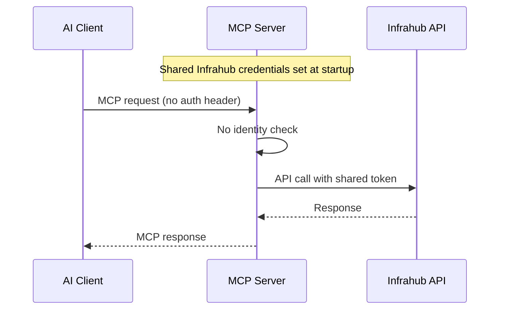
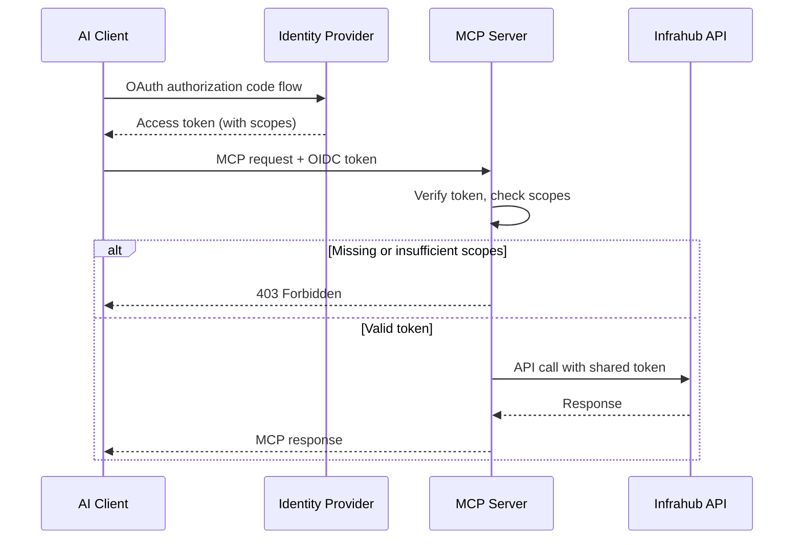
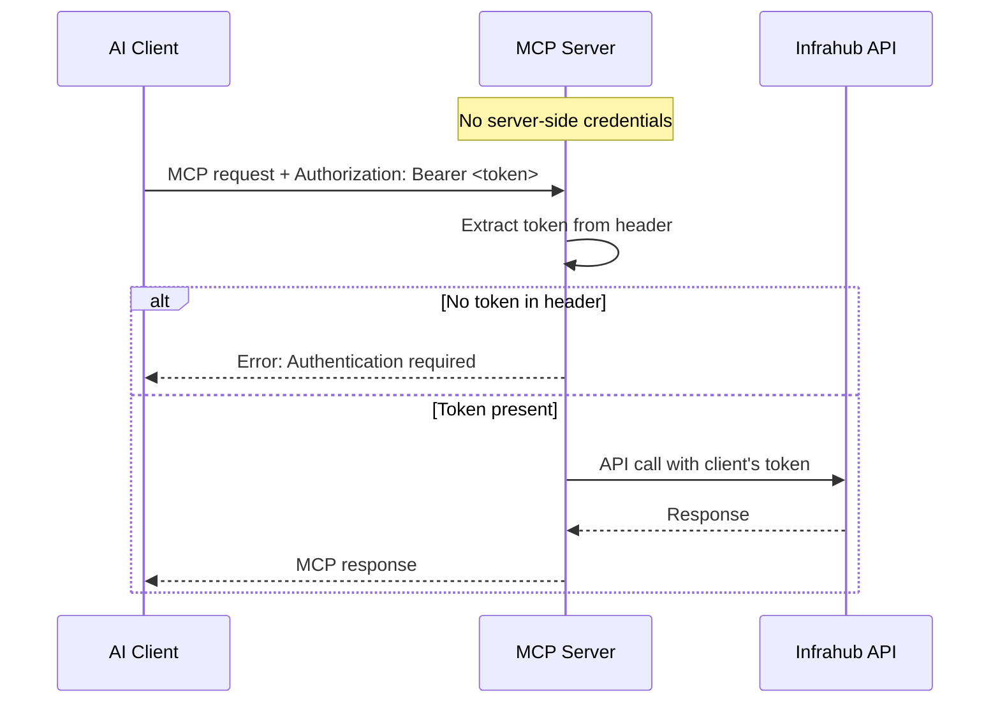
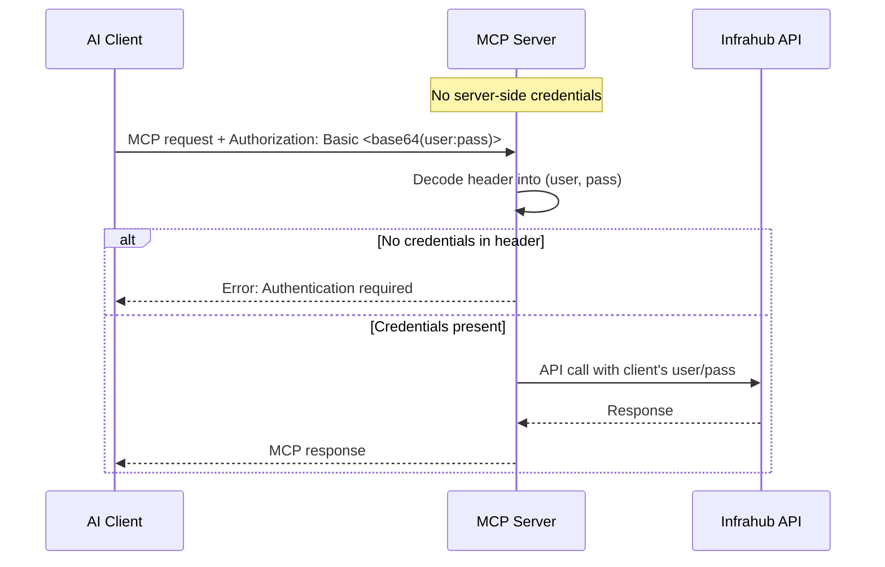

The MCP server sits between AI clients (Claude, Cursor, VS Code Copilot) and the Infrahub API. Authentication happens at two separate layers:

1. **MCP layer** — controls *who* can reach the MCP server and *what* they can do (read-only vs read-write). Configured via `INFRAHUB_MCP_AUTH_MODE`.
2. **Infrahub layer** — controls *what* the MCP server can do in Infrahub. Configured via `INFRAHUB_API_TOKEN` or `INFRAHUB_USERNAME`/`INFRAHUB_PASSWORD` (for `none` and `oidc` modes), or via the client's own credentials (for `token-passthrough` and `basic-passthrough` modes).

In `none` and `oidc` modes, the Infrahub credentials are shared across all MCP sessions — they define the ceiling of what any client can do, and the MCP auth layer narrows that ceiling per-user. In `token-passthrough` and `basic-passthrough` modes, each client provides their own Infrahub credentials, so there are no shared credentials.

## Auth modes

### `none` — shared credentials, no identity



No identity gate at the MCP level. Any client that can reach the server gets access using the shared Infrahub credentials. This is the right choice when:

- You are running the server locally via **stdio** transport (single-user, no network exposure).
- The server is behind a VPN or network-level access control and you trust all clients equally.
- You want the simplest possible setup.

No additional configuration is required beyond the standard Infrahub connection variables.

### `oidc` — identity + scopes via external IdP



External Identity Provider authentication via OpenID Connect. When enabled, the MCP server delegates authentication to a provider like Google, Okta, or Microsoft Entra using FastMCP's `OIDCProxy`. This is the right choice when:

- Multiple users share a single MCP server instance over HTTP.
- You need **audit trails** that identify who performed each action.
- You want **role-based access control** — some users get read-only, others get read-write.
- Compliance requires identity verification before infrastructure changes.

OIDC mode requires the **Streamable HTTP transport** — it is not supported over stdio.

### `token-passthrough` — client's own Infrahub token



Each MCP client provides their own Infrahub API token in the HTTP request header. The server extracts it and creates a per-request `InfrahubClient` using that token — no shared server-side credentials needed. This is the right choice when:

- Each user already has their own Infrahub API token.
- You want **end-to-end credential isolation** — the server never stores or shares tokens between users.
- You need a simpler setup than OIDC but still want multi-user support.
- You want Infrahub's native RBAC to control what each user can do.

Token passthrough is **fail-closed**: every request must carry a valid token. If the header is missing or empty, the request is rejected — there is no silent fallback to server-side credentials.

Token passthrough requires the **Streamable HTTP transport** — it is not supported over stdio (no HTTP headers available). The server rejects this combination at startup.

### `basic-passthrough` — client's own Infrahub username + password



Same fail-closed per-request model as `token-passthrough`, but clients authenticate with their Infrahub username and password via the standard HTTP `Basic` scheme. Each request constructs a fresh `InfrahubClient` — credentials are never cached or shared between requests. Use this mode when clients hold Infrahub user accounts rather than API tokens.

Like `token-passthrough`, this mode requires the **Streamable HTTP transport**.

## User identity and branch naming

When OIDC is enabled, the authenticated user identity flows into two features:

### Audit logs

Every tool call and resource read includes the user identity in structured log output:

```text
INFO  tool_call tool=get_nodes user=alice@example.com
INFO  resource_read uri=infrahub://schema user=alice@example.com
```

The claim used for identity is configurable via `INFRAHUB_MCP_OIDC_USER_CLAIM` (default: `email`). Common alternatives include `sub` (subject ID) or `preferred_username`.

### Branch placeholder

The `{user}` placeholder in `INFRAHUB_MCP_BRANCH_PATTERN` resolves to the authenticated user's identity, sanitized for git ref compatibility:

```bash
INFRAHUB_MCP_BRANCH_PATTERN=mcp/{user}/{date}-{hex}
# Produces: mcp/alice-example.com/20260409-a1b2c3d4
```

The sanitization follows `git check-ref-format` rules: characters in the set `[a-zA-Z0-9._/-]` (letters, digits, dot, underscore, slash, and dash) are preserved — all others are replaced with hyphens. For example, `alice@example.com` becomes `alice-example.com` because the `@` is replaced while the dot is preserved. Additionally, `..` sequences are collapsed to a single dot, `//` to a single slash, `/.` components are stripped (no component may start with a dot), and a trailing `.lock` suffix is removed. Leading/trailing dots, slashes, and hyphens are trimmed. If no user is available, `anonymous` is used.

## Read-only mode

Independent of auth mode, the server supports a hard read-only mode:

```bash
INFRAHUB_MCP_READ_ONLY=true
```

This provides two layers of protection:

1. **Registration time** — write tools are not mounted on the FastMCP server, so they do not appear in `tools/list`.
2. **Middleware time** — `ReadOnlyMiddleware` filters any tool tagged `write` from discovery and rejects calls, catching hardcoded tool names that bypass discovery.

The `infrahub_agent` system prompt dynamically reflects the access mode, telling the AI agent that write operations are unavailable.

Read-only mode and OIDC scope-based authorization can be combined. Use read-only mode for server-wide enforcement (for example, a monitoring-only deployment) and scopes for per-user access control.

## How auth modes interact with transports

| Transport | `none` | `oidc` | `token-passthrough` | `basic-passthrough` |
| --- | --- | --- | --- | --- |
| **stdio** | Full access via shared credentials. | Not supported — no HTTP headers. | Not supported — no HTTP headers. | Not supported — no HTTP headers. |
| **Streamable HTTP** | Full access via shared credentials. No identity tracking. | Full OIDC flow. Identity in audit logs. Scope-based write gating. | Per-request token. Each client uses their own Infrahub credentials. | Per-request username/password. Each client uses their own Infrahub credentials. |
