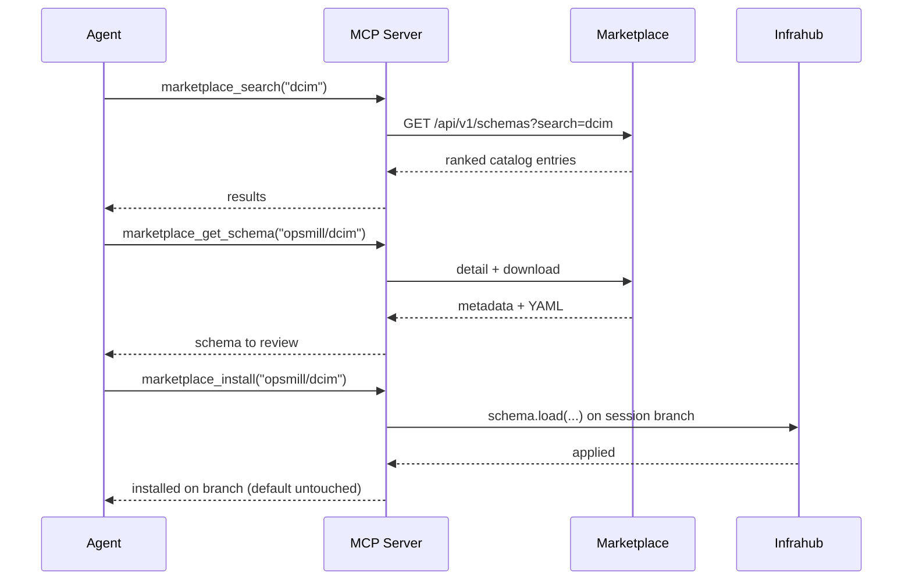

The [Infrahub Marketplace](https://marketplace.infrahub.app) hosts published, versioned schema bundles. The MCP server lets an agent **search** the catalog, **read** a schema's YAML, and **install** it into your Infrahub — without leaving the conversation to open a browser.

Discovery is read-only and anonymous. Install is a write operation: it lands on your session branch for human review, exactly like any other change.

## The flow

## Tools

| Tool | What it does |
| --- | --- |
| `marketplace_search` | Search schemas (or collections with `collections=true`) by free text; optional `tag`/`namespace` filters and `limit`. |
| `marketplace_get_schema` | Fetch a schema's metadata + YAML by `namespace/name`; pass `version` to pin a release. |
| `marketplace_get_collection` | Fetch a collection's member schemas as a single multi-document YAML stream. |
| `marketplace_install` | Load a schema onto your session branch via the SDK. **Write** — blocked in read-only mode. |

## Safety and configuration

- **Install is branch-safe**: it uses the same session branch as every other write and never touches the default branch. Merge via `propose_changes`. See [Safe changes via branch isolation](./safe-changes-branch-isolation.mdx).
- **No credentials leak outward**: marketplace requests carry no Infrahub token and honour the SDK's proxy/TLS.
- **Turn it off entirely** with `INFRAHUB_MCP_MARKETPLACE_ENABLED=false` — no tools are registered and no outbound request is made. Point at a different host with `INFRAHUB_MCP_MARKETPLACE_URL`. See the [configuration reference](../references/configuration.mdx#marketplace).

## Errors

A failed marketplace call tells you whether the problem is the reference, the content, or the service: invalid reference, not found, no such version, too large, or "cannot reach the marketplace" — so you can act without guessing.
