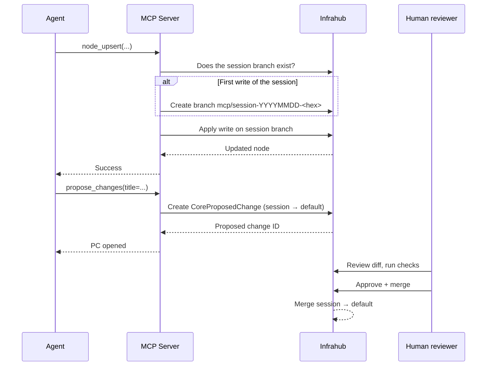

Branch isolation is the single most important safety property of the Infrahub MCP server: **an agent can never write directly to your default branch**. Every mutation lives on an ephemeral session branch that only becomes part of the default branch once a human reviews and merges a Proposed Change. This page explains the model end-to-end and shows how to tune it.

## The lifecycle of a session branch



Key properties:

- **The branch is auto-created on the first write** — the agent never names or creates it explicitly.
- **All subsequent writes in the same MCP session go to the same branch**, so a multi-step change is atomic from the reviewer's perspective.
- **`propose_changes` does not close the branch** — the session stays active, so the agent can keep iterating and the new writes land in the same proposed change.
- **Merging is human-only** — no MCP tool merges branches; that happens in the Infrahub UI or API, under whatever approval policy your organization enforces.

## Customizing the branch name

The default pattern is `mcp/session-{date}-{hex}`. Override it via `INFRAHUB_MCP_BRANCH_PATTERN`:

```bash
# Fixed branch name (must not already exist)
INFRAHUB_MCP_BRANCH_PATTERN=mcp/automation

# Per-user branch (requires OIDC auth mode)
INFRAHUB_MCP_BRANCH_PATTERN=mcp/{user}/{date}-{hex}
```

Supported placeholders:

| Placeholder | Resolves to |
| --- | --- |
| `{date}` | `YYYYMMDD` |
| `{hex}` | Short random hex |
| `{user}` | OIDC-authenticated user ID, sanitized for git refs |

If the generated name collides, the server retries up to `INFRAHUB_MCP_MAX_BRANCH_RETRIES` times (default 5, max 20). A fixed name with no placeholders cannot collide by design and must not already exist.

See [Authentication architecture — Branch placeholder](../references/authentication.mdx#branch-placeholder) for how `{user}` is sanitized.

## Making a change dry-run-able

There's no explicit dry-run flag — the session branch *is* the dry run. Review it before calling `propose_changes`:

1. Agent makes writes via `node_upsert` / `node_delete` / `mutate_graphql`.
2. Open the Infrahub UI and navigate to the session branch (listed under `infrahub://branches`).
3. Review the diff. If something is wrong, just discard the branch — the default branch never saw it.
4. Re-run the agent on a fresh session.

For a hard read-only posture (compliance analysis, monitoring agents), set `INFRAHUB_MCP_READ_ONLY=true` — writes are hidden from discovery and rejected if hardcoded.

## Combining with scope-based authorization

Under OIDC auth, you can gate write tools behind an OAuth scope:

```bash
INFRAHUB_MCP_AUTH_MODE=oidc
INFRAHUB_MCP_AUTH_SCOPES_WRITE=infrahub:write
```

Users whose token doesn't include `infrahub:write` cannot see or call write tools. Branch isolation stops agents from damaging the default branch by accident; scope gating stops *specific users* from writing at all.

## Troubleshooting

| Symptom | Likely cause | Fix |
| --- | --- | --- |
| "Branch already exists" error at startup | Fixed `INFRAHUB_MCP_BRANCH_PATTERN` and the branch is left over from a previous run | Merge or delete the branch in Infrahub, or use a pattern with `{hex}`. |
| `propose_changes` fails with "no changes" | No successful writes on the session branch | Confirm at least one `node_upsert`/`node_delete`/`mutate_graphql` succeeded. |
| Agent can't find the session branch | Branch creation failed silently | Check server logs for the branch-creation error; often a permission issue on the Infrahub API token. |
| `{user}` placeholder resolves to `anonymous` | Auth mode is `none` | Enable OIDC to get a real user identity, or use a different placeholder. |

## Related reading

- [Make a change through an agent](../getting-started/make-a-change.mdx) — the first-time walkthrough.
- [Brownfield network onboarding](./brownfield-onboarding.mdx) — branch isolation applied to bulk imports.
- [Authentication architecture](../references/authentication.mdx) — how identity flows into branch naming and audit logs.
